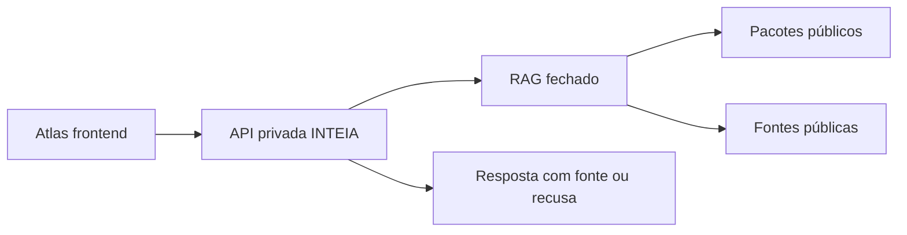

# Execução — Atlas Brasil x INTEIA

Este documento transforma o PRD em plano de trabalho implementável.

**Status:** aprovado para execução controlada.  
**Parecer de aprovação:** [`PARECER_APROVACAO_EXECUCAO.md`](PARECER_APROVACAO_EXECUCAO.md).  

## 1. Estratégia de execução

Trabalhar em duas trilhas:

1. **Trilha pública:** docs, schemas, UI, data packs sanitizados e relatórios.
2. **Trilha privada:** geração INTEIA, sanitização, auditoria e validação antes de publicar.

O repo Atlas só recebe a trilha pública.

## 2. Fase M0 — Fundação documental

Status: documentação aprovada; execução M1 liberada após validação final de segurança do pacote público.

### Entregáveis

- `docs/PRD_ATLAS_PARCEIRA_INTEIA.md`
- `docs/EXECUCAO_ATLAS_PARCEIRA_INTEIA.md`
- `docs/METODOLOGIA_PUBLICA_INTEIA.md`
- `docs/README.md`
- schemas existentes revisados
- README principal atualizado

### Critério de aceite

- documentos linkados;
- sem caminhos locais;
- sem segredos;
- schemas JSON válidos;
- fronteira público/privado explícita.

## 3. Fase M1 — Pacote Sergipe estático

Objetivo: criar a primeira demonstração pública completa.

### Tarefas

| ID | Tarefa | Saída | Aceite |
|---|---|---|---|
| M1-01 | Definir escopo público de Sergipe | `research-protocol.json` | pergunta, corpus, critérios e limites |
| M1-02 | Criar `state-pack.json` SE | JSON | schema válido |
| M1-03 | Criar `synthetic-cohort-pack.json` SE | JSON | sem persona bruta |
| M1-04 | Criar `evidence-ledger.json` SE | JSON | claims com fonte/tipo |
| M1-05 | Criar primeira simulação territorial | `simulation-pack.json` | seed, premissas, disclaimer |
| M1-06 | Criar relatório público | markdown | inclui red team e limites |
| M1-07 | Criar manifest | `manifest.json` | hashes e versão |

### Pacotes mínimos

```text
data/states/SE/state-pack.json
data/states/SE/synthetic-cohort-pack.json
data/states/SE/evidence-ledger.json
data/states/SE/simulations/territorial-base.json
data/states/SE/manifest.json
reports/sergipe/piloto-atlas-sim.md
```

### Gate de aceite

- nenhuma persona individual;
- nenhum prompt interno;
- nenhuma chave;
- nenhum caminho local;
- todas as simulações com disclaimer;
- todo número factual com fonte.

## 4. Fase M2 — UI Atlas Sim

Objetivo: o app atual deve exibir pacotes estáticos.

### Tarefas

| ID | Tarefa | Arquivos prováveis | Aceite |
|---|---|---|---|
| M2-01 | Adicionar seção "Inteligência territorial" | `index.html`, `style.css` | painel aparece sem quebrar layout |
| M2-02 | Carregar data pack por UF selecionada | `app.js` | SE carrega sob demanda |
| M2-03 | Renderizar forças/fraquezas/oportunidades | `app.js` | cards aparecem |
| M2-04 | Renderizar Evidence Ledger | `app.js`, `style.css` | claims clicáveis |
| M2-05 | Criar seção Atlas Sim | `index.html`, `app.js` | simulação estática renderiza |
| M2-06 | Mostrar tipo de claim | `style.css` | fato/inferência/simulação distinguíveis |
| M2-07 | Mostrar disclaimer obrigatório | `app.js` | disclaimer visível |

### Restrições técnicas

- manter app estático;
- sem build step;
- sem chaves;
- fetch apenas para arquivos locais e APIs públicas permitidas na CSP;
- carregar pacotes sob demanda.

### Observação sobre `app.js`

O arquivo está grande. Para M2, pode-se fazer uma implementação incremental. Para M3, recomenda-se modularizar:

```text
src/
  data-loader.js
  intelligence-panel.js
  atlas-sim.js
  evidence-ledger.js
  formatters.js
```

Enquanto não houver build, módulos podem ser scripts ES module ou funções organizadas no próprio `app.js`.

## 5. Fase M3 — São Paulo escala

Objetivo: provar robustez com estado grande.

### Tarefas

| ID | Tarefa | Saída | Aceite |
|---|---|---|---|
| M3-01 | Criar state pack SP | JSON | schema válido |
| M3-02 | Criar coortes regionais SP | JSON | agregadas |
| M3-03 | Criar clusters territoriais | JSON | nomes e critérios |
| M3-04 | Criar simulação econômica | JSON | oportunidade com riscos |
| M3-05 | Testar performance | relatório | app não trava |

### Estratégia de performance

- carregar SP somente quando selecionado;
- evitar renderizar listas gigantes;
- limitar cards iniciais;
- usar rankings top N;
- cache local.

## 6. Fase M4 — Gerador privado INTEIA

Objetivo: automatizar geração de pacotes públicos sem expor núcleo privado.

### Componentes privados

- extractor: lê dados privados e públicos;
- aggregator: transforma personas em coortes;
- redactor: remove campos proibidos;
- oracle pass: valida fontes e claims;
- helena pass: diagnóstico, simulação e recomendação;
- gate pass: privacidade, números, simulação e editorial;
- exporter: escreve JSON público;
- manifest: hashes e versão.

### Contrato do exporter

Entrada privada:

- estado/cidade;
- fonte pública;
- base sintética privada;
- pergunta de pesquisa;
- cenário.

Saída pública:

- apenas pacotes sanitizados.

### Gate hard

O exporter falha se encontrar:

- `nome`;
- biografia;
- prompt;
- chave;
- path local;
- token;
- log bruto;
- campo não autorizado.

## 7. Fase M5 — Assistente territorial

Objetivo: permitir conversa sobre cidade/estado sem expor chave no frontend.

### Arquitetura



### Regras

- frontend nunca chama LLM diretamente;
- resposta cita fonte;
- resposta marca inferência;
- sem fonte, recusa;
- logs privados não vão ao repo.

## 8. Backlog consolidado

### P0

- PRD e metodologia.
- Schemas públicos.
- Pacote Sergipe.
- Intelligence Panel.
- Evidence Ledger.
- Atlas Sim estático.
- Gates de privacidade.

### P1

- Pacote São Paulo.
- Opportunity Cards.
- Relatórios markdown.
- City packs.
- Testes de schema.
- Modularização do JS.

### P2

- Assistente territorial.
- Forecast ledger público.
- Contribuição externa por PR.
- Pipeline privado automatizado.
- Visualizações avançadas.

## 9. Checklist por pull request

Antes de merge:

```text
[ ] Não inclui .env, log, jsonl, db ou artefato privado.
[ ] Não inclui caminho local.
[ ] Não inclui persona bruta.
[ ] JSON valida.
[ ] Números têm fonte.
[ ] Simulações têm disclaimer.
[ ] README/docs atualizados.
[ ] App abre localmente.
```

## 10. Comandos de verificação atuais

Como o repo é estático:

```powershell
python -m http.server 8000 --bind localhost
```

Verificações documentais:

```powershell
Get-ChildItem -Path docs\schemas -Filter *.json | ForEach-Object {
  Get-Content -Raw $_.FullName | ConvertFrom-Json | Out-Null
}

git diff --check

Select-String -Path README.md,docs\*.md,docs\schemas\*.json `
  -Pattern 'ABSOLUTE_LOCAL_PATH|PRIVATE_USER|SECRET_MARKER|KEY_MARKER|AUTH_MARKER'
```

## 11. Definition of Done por milestone

### M1 pronto

- Sergipe tem pacote público mínimo;
- relatório explica método;
- nenhuma informação privada;
- dados carregam no navegador.

### M2 pronto

- usuário vê Atlas Sim;
- usuário vê evidence ledger;
- usuário entende diferença entre dado e simulação.

Status atual: M2 mínima validada com painel Atlas Sim carregando Sergipe sob demanda. Detalhes em [`EXECUCAO_M2_ATLAS_SIM_UI.md`](EXECUCAO_M2_ATLAS_SIM_UI.md).

### M3 pronto

- SP carrega sem travar;
- clusters/regionais fazem sentido;
- performance documentada.

### M4 pronto

- geração privada produz pacote público;
- sanitizer bloqueia campos proibidos;
- manifest reproduzível.

### M5 pronto

- assistente responde com fonte;
- recusa quando não sabe;
- nenhuma chave no frontend.

## 12. Gates Helena e Efesto

Toda implantação deve passar pelos gates documentais e técnicos abaixo.

### Gate Helena

- fatos, inferências, simulações e recomendações separados;
- claims relevantes com fonte e data de acesso;
- simulações com premissas, limites e disclaimer;
- agentes sintéticos apenas em forma agregada;
- forecasts com ledger, horizonte e métrica posterior;
- conclusões fortes com red team e nível de confiança.

### Gate Efesto

- validação de schema antes de publicar pacote;
- varredura de segredos e caminhos locais antes de merge;
- rollback e verificação pós-publicação antes de deploy;
- manifest com versão e hashes nos pacotes públicos;
- carregamento sob demanda para pacotes grandes;
- evidência objetiva de conclusão ao fim de cada milestone.

### Assinaturas de execução

**Helena Strategos Inteia:** aprovado para execução metodológica e científica.  
**Efesto:** aprovado para execução técnica e operacional controlada.
