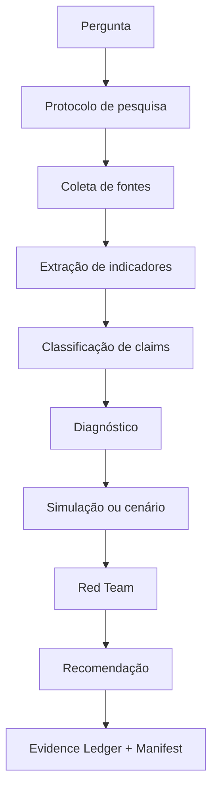

# Metodologia pública INTEIA para o Atlas Brasil

Este documento explica a parte compartilhável da metodologia INTEIA usada no Atlas Brasil.

## 1. Princípio central

O Atlas não entrega "opinião da IA". Entrega leitura territorial com:

- fonte;
- método;
- inferência marcada;
- simulação rotulada;
- previsão calibrável;
- limite explícito.

## 2. Pipeline público



## 3. Tipos de afirmação

| Tipo | Definição | Exemplo |
|---|---|---|
| Fato | Dado diretamente apoiado por fonte | População no Censo 2022 |
| Inferência | Interpretação baseada em fatos | O município mostra pressão sobre serviços |
| Previsão | Afirmação resolvível no futuro | Emprego formal tende a crescer no cenário base |
| Simulação | Saída de modelo ou coorte sintética | Reação estimada de arquétipos |
| Premissa | Hipótese usada no cálculo | Manter tendência dos últimos anos |
| Opinião | Juízo editorial sem status factual | Este é um risco relevante |

## 4. Evidence Ledger

Cada claim importante deve ser registrada.

Campos:

- `claimId`;
- `text`;
- `kind`;
- `evidenceLevel`;
- `sources`;
- `year`;
- `confidence`;
- `limitations`.

## 5. Confiança

### Alta

Quando:

- fonte primária oficial;
- número direto ou derivação simples;
- ano claro;
- unidade clara;
- baixa controvérsia metodológica.

### Média

Quando:

- fonte confiável, mas indireta;
- proxy necessário;
- comparação depende de recorte;
- dados incompletos mas suficientes.

### Baixa

Quando:

- fonte limitada;
- proxy fraco;
- simulação exploratória;
- ausência de base rate;
- alta sensibilidade às premissas.

## 6. Poder preditivo

O poder preditivo do Atlas deve ser avaliado por acerto posterior.

Elementos mínimos:

- pergunta resolvível;
- horizonte temporal;
- probabilidade ou faixa;
- base rate;
- premissas;
- gatilhos de atualização;
- fonte de resolução;
- Brier score quando resolvido.

Exemplo:

```json
{
  "forecastId": "se-emprego-2027-base",
  "question": "O emprego formal em SE crescerá em 2027 contra 2026?",
  "asOf": "2026-05-04",
  "probability": 0.61,
  "confidence": "media",
  "baseRate": "crescimento observado em anos comparáveis",
  "resolutionSource": "RAIS/CAGED",
  "triggers": [
    "queda de admissões por 3 meses",
    "novo investimento industrial confirmado"
  ]
}
```

## 7. Simulações

Simulações são hipóteses estruturadas, não fatos.

Toda simulação deve declarar:

- tipo;
- cenário;
- seed ou versão;
- fatos de entrada;
- premissas;
- métrica;
- resultado;
- limite;
- disclaimer.

## 8. Agentes sintéticos

Uso público permitido:

- coortes agregadas;
- arquétipos;
- pesos;
- métricas agregadas;
- traces sanitizados.

Uso público proibido:

- persona individual;
- biografia;
- nome;
- prompt;
- instrução comportamental;
- base completa;
- saída sem revisão.

## 9. Red Team

Toda conclusão forte precisa de contra-hipótese:

- o que poderia provar que estamos errados?
- qual dado está faltando?
- qual fonte contradiz?
- qual premissa é mais fraca?
- o que muda a decisão?

## 10. Gates

### Factual

Bloqueia:

- número sem fonte;
- ranking sem universo;
- comparação sem período;
- unidade ambígua.

### Simulação

Bloqueia:

- ausência de disclaimer;
- ausência de premissas;
- simulação tratada como fato;
- ausência de limites.

### Privacidade

Bloqueia:

- dado privado;
- path local;
- chave;
- log;
- prompt interno;
- persona bruta.

### Editorial

Bloqueia:

- certeza indevida;
- linguagem partidária ofensiva;
- headline maior que evidência;
- recomendação sem risco.

## 11. Publicação open source

Pode publicar:

- fontes oficiais;
- schemas;
- metodologia;
- coortes agregadas;
- simulações sanitizadas;
- relatórios públicos.

Não pode publicar:

- ativos privados INTEIA;
- dados de cliente;
- segredos;
- motores internos;
- bases sintéticas brutas.

## 12. Frase pública do método

> O Atlas Brasil x INTEIA combina dados públicos, método de evidência, simulações sintéticas agregadas e avaliação preditiva calibrável para explicar territórios brasileiros com transparência.
