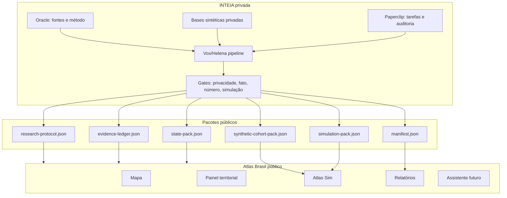

# PRD — Atlas Brasil x INTEIA

**Produto:** Atlas Brasil x INTEIA  
**Camada pública:** Atlas Brasil, Atlas Sim, Evidence Ledger, relatórios territoriais  
**Camada privada:** tecnologia INTEIA/Helena/Vox/Paperclip/Oracle como motor gerador e auditor  
**Status:** aprovado para execução controlada  
**Data:** 2026-05-04  
**Parecer:** [`PARECER_APROVACAO_EXECUCAO.md`](PARECER_APROVACAO_EXECUCAO.md)  

## 1. Sumário executivo

O Atlas Brasil nasce como um mapa interativo de dados territoriais do país. A parceria pública com a INTEIA deve levá-lo para outro nível: um atlas vivo que não apenas mostra dados, mas transforma dados em diagnóstico, simulação, decisão e aprendizado.

O objetivo não é publicar toda a tecnologia INTEIA. O objetivo é divulgar uma parte compartilhável, científica e auditável dela:

- método de pesquisa com evidência;
- análise territorial com fontes;
- simulações com agentes sintéticos agregados;
- recomendações práticas com premissas;
- poder preditivo medido, calibrado e revisável;
- interface pública simples, bonita e transparente.

O Atlas será a vitrine pública. A INTEIA será o motor privado de inteligência. A ponte entre os dois será feita por pacotes estáticos sanitizados, schemas públicos, manifests e evidence ledgers.

## 2. Tese de produto

O usuário comum não precisa de uma planilha de 200 indicadores. Ele precisa responder:

- minha cidade melhorou ou piorou?
- onde estão os gargalos?
- onde estão as oportunidades?
- vale abrir uma farmácia, padaria, clínica ou escola técnica?
- vale estudar medicina, enfermagem, direito, programação ou curso técnico nesta região?
- qual política pública teria mais impacto?
- como a opinião pública local poderia reagir a um evento?
- quais dados sustentam essa conclusão?
- o que ainda não sabemos?

O Atlas Brasil x INTEIA deve responder isso de forma clara, visual e rastreável.

## 3. Posicionamento público

**Nome da camada:** Atlas Sim  
**Subtítulo:** Simulações territoriais com dados, fontes e limites explícitos.  
**Promessa pública:** entender territórios brasileiros com método, evidência e simulações auditáveis.  

Mensagem central:

> O Atlas Brasil x INTEIA transforma dados públicos em leitura territorial, diagnósticos, oportunidades e simulações. Cada afirmação importante carrega fonte, nível de confiança e limite explícito.

O projeto deve mostrar sofisticação sem cair em autoridade falsa. A força está em declarar método, incerteza e evidência.

## 4. Objetivos

### 4.1 Objetivos do produto

1. Criar uma experiência pública de inteligência territorial sobre o Brasil.
2. Demonstrar parte da tecnologia INTEIA sem expor ativos privados.
3. Publicar metodologia clara de evidência, simulação e previsão.
4. Criar pilotos em Sergipe e São Paulo.
5. Permitir que outros contribuam com dados, visualizações, schemas e city packs.
6. Preparar o Atlas para um futuro assistente territorial com RAG fechado.

### 4.2 Objetivos de decisão

O Atlas deve ajudar decisões em cinco domínios:

- território: melhorou, piorou, estabilizou ou ficou inconclusivo;
- negócios: abrir, evitar, testar ou estudar melhor;
- carreira: estudar, migrar, especializar ou aguardar;
- política pública: priorizar, medir, validar ou descartar;
- opinião pública: simular reação, risco, propagação e grupos sensíveis.

### 4.3 Objetivos de divulgação

1. Mostrar publicamente que a INTEIA possui método e ciência, não apenas interface.
2. Criar prova pública de capacidade com dados abertos.
3. Atrair colaboradores, pesquisadores, cidades e parceiros.
4. Proteger o núcleo privado e comercial.

## 5. Não-objetivos

O Atlas público não será:

- substituto de pesquisa de campo;
- self-service completo da tecnologia INTEIA;
- publicação de bases brutas de agentes sintéticos;
- app com chaves de IA no frontend;
- plataforma eleitoral de cliente privado;
- fonte de certeza absoluta;
- repositório de prompts internos, logs, memórias ou segredos.

## 6. Usuários

### U1. Cidadão curioso

Quer entender sua cidade sem ler relatórios técnicos.

Precisa:

- resumo simples;
- mapa;
- "melhorou ou piorou";
- fontes acessíveis;
- explicação de limites.

### U2. Empreendedor local

Quer decidir onde abrir ou testar um negócio.

Precisa:

- oportunidade por setor;
- população, renda, fluxo e demanda provável;
- riscos;
- perguntas de validação de campo.

### U3. Estudante/profissional

Quer escolher carreira com base em território.

Precisa:

- sinais de demanda regional;
- oferta de serviços;
- perspectiva por horizonte;
- alternativas.

### U4. Gestor público/pesquisador

Quer diagnóstico territorial com fonte.

Precisa:

- indicadores;
- comparação com pares;
- série histórica;
- lacunas;
- evidence ledger.

### U5. Comunidade open source

Quer contribuir com dados, visualizações e pacotes.

Precisa:

- schemas;
- documentação;
- exemplos;
- testes;
- fronteira clara do que pode ou não entrar.

## 7. Estado atual do Atlas

O repo atual é um app estático:

- `index.html`: estrutura da UI.
- `style.css`: layout visual.
- `app.js`: lógica do mapa, dados IBGE/SIDRA, rankings, análises, cache e preferências.

Funcionalidades já existentes:

- MapLibre com globo e mapa;
- população por estados e municípios;
- PIB e PIB por habitante;
- política estimada por cargos;
- educação simulada/projetada;
- busca territorial;
- ranking e gráficos;
- cache local;
- fontes públicas do IBGE/SIDRA.

Lacunas:

- não há PRD canônico;
- não há data packs locais;
- não há evidence ledger;
- não há metodologia pública;
- não há Atlas Sim;
- não há assistente;
- `app.js` está monolítico;
- parte de educação/PIB projetado precisa rótulo mais claro;
- não há validação automática de schemas.

## 8. Tecnologia INTEIA compartilhável

### 8.1 O que pode ser público

- metodologia de evidência;
- protocolos de pesquisa;
- formatos de relatório;
- schemas de pacote;
- coortes sintéticas agregadas;
- simulações sanitizadas;
- manifests e hashes;
- exemplos com dados públicos;
- UI de leitura territorial;
- gates documentais;
- rankings e métricas derivadas de fonte pública.

### 8.2 O que permanece privado

- bases sintéticas brutas;
- prompts internos completos;
- memória operacional;
- logs;
- chaves;
- clientes;
- orquestração Paperclip real;
- motor privado Vox/Helena;
- conectores e endpoints internos;
- relatórios comerciais.

### 8.3 Ponte público/privado

A camada privada gera:

- `state-pack.json`;
- `city-pack.json`;
- `synthetic-cohort-pack.json`;
- `simulation-pack.json`;
- `research-protocol.json`;
- `evidence-ledger.json`;
- `sources.json`;
- `manifest.json`.

O Atlas público consome esses arquivos como dados estáticos.

## 9. Arquitetura alvo



## 10. Método público

O método público combina duas funções:

### Oracle: porteiro da evidência

Responsável por:

- pergunta de pesquisa;
- corpus;
- critérios de inclusão/exclusão;
- hierarquia de fonte;
- fato vs inferência;
- limites e lacunas.

### Helena: motor de decisão

Responsável por:

- diagnóstico;
- mecanismo;
- cenário;
- simulação;
- recomendação;
- red team;
- confiança.

Regra:

> Oracle define o que pode ser afirmado. Helena define o que isso muda na decisão.

## 11. Hierarquia de evidência

1. `primary_official`: IBGE, INEP, TSE, RAIS/CAGED, DATASUS, Tesouro, prefeitura com dado aberto.
2. `primary_non_official`: coleta própria publicável ou base primária sanitizada.
3. `systematic_review`: revisão sistemática ou meta-análise.
4. `secondary_analysis`: relatório técnico, instituto, imprensa com dado rastreável.
5. `expert_interpretation`: interpretação especializada.
6. `simulation`: saída de agente sintético ou cenário.
7. `assumption`: premissa declarada.

Fato, simulação e premissa precisam aparecer visualmente diferentes.

## 12. Poder preditivo

O Atlas deve apresentar poder preditivo como disciplina mensurável, não como adivinhação.

Componentes:

- forecast com pergunta resolvível;
- data de corte;
- base rate;
- premissas;
- intervalo;
- confiança;
- gatilhos de atualização;
- Brier score quando houver resultado posterior;
- log de previsões públicas;
- red team.

Tipos de previsão permitidos:

- tendência territorial;
- risco de piora;
- oportunidade econômica;
- pressão sobre serviços;
- probabilidade qualitativa de cenário;
- difusão simulada de opinião.

Bloqueio:

- previsão sem data de resolução;
- previsão sem premissas;
- previsão sem base rate ou justificativa de ausência;
- previsão apresentada como certeza.

## 13. Atlas Sim

Atlas Sim é a camada pública de simulações territoriais.

### 13.1 Tipos de simulação

1. Territorial: melhorou/piorou, gargalos, drivers.
2. Negócio: farmácia, padaria, clínica, escola, serviço local.
3. Carreira: medicina, enfermagem, tecnologia, direito, técnico industrial.
4. Política pública: saúde, transporte, educação, segurança, habitação.
5. Opinião pública: reação, propagação, fases e grupos agregados.

### 13.2 Saída mínima

Toda simulação deve mostrar:

- tipo;
- cenário;
- seed ou versão;
- fatos usados;
- premissas;
- resultado;
- recomendações;
- riscos;
- limitações;
- disclaimer;
- fontes.

### 13.3 Disclaimer padrão

> Esta é uma simulação com dados públicos e/ou coortes sintéticas agregadas. Não substitui pesquisa de campo, auditoria técnica local ou decisão profissional. Use como hipótese inicial para investigação.

## 14. Agentes sintéticos públicos

O Atlas não publica agentes brutos. Publica arquétipos e coortes agregadas.

Níveis:

- arquétipo;
- coorte;
- segmento;
- trace sanitizado;
- métrica agregada.

Campos proibidos:

- nome de persona;
- biografia individual;
- instrução comportamental completa;
- prompt interno;
- ID privado;
- texto bruto sensível;
- qualquer base integral.

## 15. Pilotos

### 15.1 Sergipe — profundidade

Por que Sergipe:

- menor complexidade territorial;
- base sintética privada existente;
- fixtures já existentes no Vox;
- bom piloto para ciclo completo.

Entregáveis:

- state pack de Sergipe;
- coorte sintética agregada;
- simulação territorial;
- simulação de oportunidade local;
- evidence ledger;
- relatório público;
- UI Atlas Sim.

### 15.2 São Paulo — escala

Por que São Paulo:

- estado grande e diverso;
- base sintética privada maior;
- stress test de performance;
- clusters regionais;
- prova de que o método escala.

Entregáveis:

- state pack SP;
- coortes regionais;
- clusters de cidades;
- ranking de oportunidades;
- simulação econômica;
- teste de performance.

## 16. Funcionalidades

### F1. Intelligence Panel

Painel com:

- veredito territorial;
- score;
- confiança;
- forças;
- fraquezas;
- oportunidades;
- riscos;
- limites.

### F2. Evidence Ledger

Lista clicável de claims:

- texto;
- tipo;
- fonte;
- ano;
- nível de evidência;
- confiança;
- limitação.

### F3. Atlas Sim

Interface para escolher:

- UF;
- cidade;
- domínio;
- cenário;
- intensidade;
- pacote estático disponível.

### F4. Opportunity Cards

Cards para:

- farmácia;
- padaria;
- clínica;
- curso;
- carreira;
- política pública.

Cada card mostra:

- score;
- premissas;
- evidências;
- riscos;
- próxima validação.

### F5. Public Reports

Relatórios markdown renderizados no Atlas:

- resumo executivo;
- pergunta de pesquisa;
- dados;
- diagnóstico;
- simulação;
- red team;
- recomendação;
- limites;
- fontes.

### F6. Assistente futuro

Chat com:

- RAG fechado;
- evidence ledger;
- fontes públicas;
- recusa quando faltar fonte;
- sem chave no frontend.

## 17. Requisitos funcionais

| ID | Requisito | Prioridade |
|---|---|---|
| RF-01 | Carregar `state-pack.json` por UF | P0 |
| RF-02 | Validar pacotes contra schemas | P0 |
| RF-03 | Mostrar Intelligence Panel | P0 |
| RF-04 | Mostrar Evidence Ledger | P0 |
| RF-05 | Carregar simulation packs estáticos | P0 |
| RF-06 | Diferenciar fato, inferência, simulação e premissa | P0 |
| RF-07 | Mostrar disclaimers de simulação | P0 |
| RF-08 | Criar piloto Sergipe | P0 |
| RF-09 | Criar piloto São Paulo | P1 |
| RF-10 | Criar Opportunity Cards | P1 |
| RF-11 | Renderizar relatórios markdown | P1 |
| RF-12 | Adicionar assistente via backend privado | P2 |
| RF-13 | Criar forecast ledger público | P2 |
| RF-14 | Permitir contribuição de city packs | P2 |

## 18. Requisitos não funcionais

### Segurança

- zero segredo no repo;
- zero chave no frontend;
- CSP mantida;
- dados privados bloqueados;
- paths locais proibidos;
- logs brutos proibidos.

### Performance

- app inicial deve carregar rápido;
- pacotes grandes devem ser carregados sob demanda;
- SP deve ser testado como carga alta;
- dados devem ser cacheados no navegador.

### Acessibilidade

- textos legíveis;
- contraste adequado;
- controles com labels;
- estados vazios claros;
- não depender só de cor para confiança/risco.

### Reprodutibilidade

- todo pacote tem `manifestHash`;
- todo relatório tem fontes;
- toda simulação tem versão/seed;
- toda previsão tem data de corte.

## 19. Modelo de dados

Schemas públicos já definidos:

- `atlas-state-pack.schema.json`;
- `atlas-synthetic-cohort.schema.json`;
- `atlas-simulation-pack.schema.json`;
- `atlas-research-protocol.schema.json`.

Schemas futuros:

- `atlas-city-pack.schema.json`;
- `atlas-evidence-ledger.schema.json`;
- `atlas-opportunity-pack.schema.json`;
- `atlas-forecast-ledger.schema.json`;
- `atlas-manifest.schema.json`.

## 20. Estrutura alvo do repo

```text
data/
  states/
    SE/
      state-pack.json
      synthetic-cohort-pack.json
      evidence-ledger.json
      simulations/
        territorial-base.json
        business-farmacia-base.json
      manifest.json
    SP/
      state-pack.json
      synthetic-cohort-pack.json
      evidence-ledger.json
      simulations/
        territorial-base.json
      manifest.json

  cities/
    2800308/
      city-pack.json
      opportunities.json
      evidence-ledger.json
      manifest.json

docs/
  PRD_ATLAS_PARCEIRA_INTEIA.md
  EXECUCAO_ATLAS_PARCEIRA_INTEIA.md
  METODOLOGIA_PUBLICA_INTEIA.md
  schemas/

reports/
  sergipe/
  sao-paulo/
```

## 21. Roadmap macro

### M0. Fundação documental

- PRD;
- execução;
- metodologia;
- schemas;
- README.

### M1. Pacote Sergipe estático

- state pack;
- synthetic cohort;
- simulation pack;
- evidence ledger;
- manifest;
- relatório.

### M2. UI Atlas Sim

- painel;
- cards;
- ledger;
- simulações;
- disclaimers.

### M3. São Paulo escala

- state pack SP;
- coortes regionais;
- clusters;
- teste de performance.

### M4. Gerador privado INTEIA

- exporter privado;
- sanitizer;
- validator;
- manifest;
- auditoria.

### M5. Assistente territorial

- backend privado;
- RAG fechado;
- fonte por resposta;
- recusa honesta.

## 22. Métricas de sucesso

Produto:

- tempo até entender uma cidade;
- número de claims com fonte;
- número de pacotes válidos;
- estados/cidades cobertos;
- contribuições externas úteis.

Qualidade:

- 0 secrets no repo;
- 0 personas brutas publicadas;
- 100% dos números com fonte;
- 100% das simulações com disclaimer;
- 100% dos pacotes com schema válido.

Poder preditivo:

- forecasts resolvidos;
- Brier score;
- calibração por faixa;
- taxa de atualização por gatilho;
- erro médio de oportunidade quando houver validação posterior.

## 23. Riscos

| Risco | Mitigação |
|---|---|
| Simulação parecer pesquisa real | Disclaimer, visual próprio e gate |
| Expor tecnologia privada | Sanitizer, `.gitignore`, revisão manual |
| Overclaim de IA | Hierarquia de evidência e limites |
| Pacotes grandes travarem app | Lazy loading, compressão e SP como stress test |
| Dados públicos desatualizados | `generatedAt`, `accessedAt`, versão e alertas |
| Contribuição externa ruim | schemas, checklist, revisão |
| Monolito `app.js` dificultar evolução | refatorar em módulos quando Atlas Sim entrar |

## 24. Critérios de aceite gerais

Uma entrega só é aceita se:

- carrega no navegador;
- não depende de segredo;
- valida schemas;
- mostra fontes;
- separa fato/inferência/simulação;
- informa limitações;
- passa varredura de segurança;
- não publica dados privados;
- melhora a leitura territorial real do usuário.

## 25. Decisão final

O Atlas Brasil x INTEIA deve ser uma vitrine pública de inteligência territorial com ambição alta e disciplina de evidência.

Formulação pública:

> Ciência territorial aplicada. Dados oficiais, simulações auditáveis, agentes sintéticos agregados e poder preditivo calibrado.

Formulação interna:

> O Atlas mostra a superfície compartilhável da INTEIA. O motor privado permanece protegido. A ponte é pacote sanitizado, schema e evidence ledger.

## 26. Aprovação Helena e Efesto

Este PRD está aprovado para execução controlada conforme o parecer documental de `/hel` e `/efesto` em [`PARECER_APROVACAO_EXECUCAO.md`](PARECER_APROVACAO_EXECUCAO.md).

A aprovação vale para a camada pública do Atlas Brasil x INTEIA: metodologia, schemas, pacotes sanitizados, coortes agregadas, simulações auditáveis, relatórios reproduzíveis e interface pública.

Não está aprovada a publicação de tecnologia privada, bases brutas, prompts internos, logs, memórias, chaves, caminhos locais, clientes, artefatos operacionais ou agentes individuais.

**Assinaturas de aprovação documental:**

- Helena Strategos Inteia: aprovação metodológica, científica e preditiva.
- Efesto: aprovação técnica, operacional e de implantação controlada.
