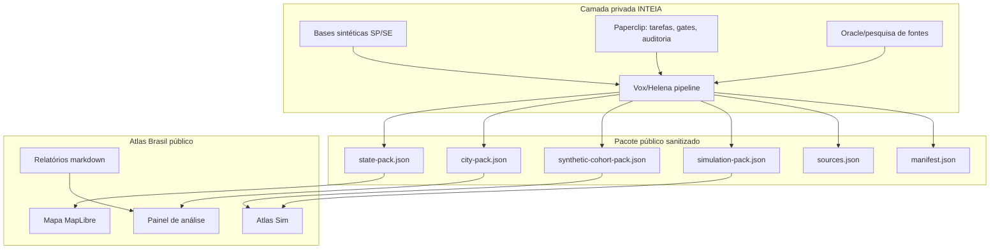

# Plano de empoderamento do Atlas: SP, Sergipe e Atlas Sim

Este documento aprofunda como transformar o Atlas Brasil em um projeto aberto com inteligência territorial, simulações e agentes sintéticos, usando as ideias, códigos e métodos internos da INTEIA sem expor operação privada, dados brutos, prompts internos, chaves, logs ou bases sensíveis.

## Tese

O Atlas deve virar três coisas ao mesmo tempo:

1. **Mapa territorial inteligente:** mostra população, economia, educação, saúde, política, empresas, emprego e evolução histórica.
2. **Motor de decisão local:** responde perguntas práticas, como abrir farmácia, padaria, curso, clínica, indústria leve, escolher profissão ou priorizar política pública.
3. **Laboratório de simulação:** usa agentes sintéticos e cenários para testar hipóteses, sempre com rótulo claro de simulação, fonte, limite e confiança.

O projeto aberto deve publicar a camada auditável e reutilizável. A camada privada INTEIA/Helena/Vox/Paperclip gera, audita e sanitiza os pacotes.

## O que foi encontrado de mais relevante

### Sergipe

Existe base sintética de Sergipe no acervo privado, com **1.000 perfis** e atributos demográficos, políticos, comportamentais, psicográficos, bem-estar, mídia, confiança institucional, religião, mobilidade, classe social e intenção eleitoral.

Existe também fixture de briefing e benchmark de Sergipe no Vox Sintética, indicando que Sergipe já é o melhor estado para o primeiro piloto de simulação completa.

Uso recomendado no Atlas:

- estado piloto para "Atlas Sim";
- primeira vitrine de agentes sintéticos agregados;
- primeira demonstração de cenário territorial;
- primeiro teste de relatório com disclaimer forte: simulação sintética, não pesquisa de campo.

### São Paulo

Existe base sintética de SP com **5.000 perfis** e atributos de mesorregião, demografia, política, consumo, mobilidade, saúde, religião, psicometria, confiança institucional, ansiedade econômica, moral foundations e intenção eleitoral.

Uso recomendado no Atlas:

- stress test de escala;
- clusterização de cidades e regiões;
- comparação metrópole/interior/litoral;
- validação de performance visual e de simulação;
- segundo estado público após Sergipe.

### Vox Sintética

Já existem contratos e implementação parcial/avançada para:

- harness de 14 estágios;
- segmentação estratégica;
- simulação de impacto;
- ranking de recomendações;
- VoterTwin;
- propagação de opinião pública;
- gate de revisão;
- elegibilidade de entrega;
- bundle e verificação.

Uso recomendado no Atlas:

- não copiar o motor privado;
- adaptar o contrato conceitual para schemas públicos;
- exportar apenas pacotes sanitizados.

## Arquitetura do Atlas Sim



## Regra de ouro

O repo público nunca recebe agentes brutos. Ele recebe **coortes sintéticas agregadas**, arquétipos, distribuições, métricas e traces sanitizados.

Exemplo correto:

- "Segmento A: trabalhador urbano evangélico, renda 1-3 salários, alta preocupação com segurança, 18% da coorte."

Exemplo proibido:

- JSON bruto de 1.000 ou 5.000 personas com biografias, nomes, instruções comportamentais, prompts, IDs internos ou campos de geração.

## Modelo público de agentes sintéticos

No Atlas, "agente sintético" deve significar uma unidade pública e segura para simulação, não um clone de pessoa e não a persona bruta privada.

### Níveis

1. **Archetype:** grupo agregado e interpretável.
2. **Synthetic cohort:** conjunto de arquétipos com pesos.
3. **Simulation agent:** representação mínima usada em uma rodada, sem biografia sensível.
4. **Trace:** registro do que aconteceu na simulação, com seed, eventos, métricas e verificadores.

### Exemplo público

```json
{
  "id": "se-arq-001",
  "label": "Interior de baixa renda com alto peso religioso",
  "scope": { "uf": "SE", "level": "state" },
  "weight": 0.18,
  "attributes": {
    "renda": "1-3 salarios",
    "territorio": "interior",
    "religiao": "alta relevancia",
    "mobilidade": "dependente de transporte local"
  },
  "decisionDrivers": [
    "custo de vida",
    "seguranca",
    "acesso a saude",
    "confiança em liderancas locais"
  ],
  "confidence": "media",
  "sourcePolicy": "derived_aggregate_not_raw_persona"
}
```

## Tipos de simulação

### 1. Simulação territorial

Pergunta:

- "A cidade melhorou ou piorou?"
- "Qual área mais puxa o resultado?"
- "O que explica a divergência contra cidades parecidas?"

Saída:

- veredito;
- indicadores contribuintes;
- pontos fortes e fracos;
- incerteza;
- fontes.

### 2. Simulação econômica local

Pergunta:

- "Vale abrir uma farmácia?"
- "Vale abrir uma padaria?"
- "Qual bairro/cidade tem melhor sinal?"

Entrada:

- população;
- renda;
- envelhecimento;
- fluxo urbano;
- empregos;
- concorrência se houver fonte;
- saúde;
- distância/centralidade quando disponível.

Saída:

- score de oportunidade;
- premissas;
- riscos;
- dados faltantes;
- pergunta de validação de campo.

### 3. Simulação educacional/profissional

Pergunta:

- "Vale estudar medicina?"
- "Vale estudar enfermagem, direito, programação, técnico industrial?"
- "A cidade absorve esse profissional?"

Entrada:

- oferta de emprego;
- salário regional quando houver fonte;
- perfil etário;
- saúde/equipamentos;
- universidades próximas;
- tendências econômicas.

Saída:

- recomendação por horizonte;
- risco de saturação;
- mobilidade necessária;
- alternativas comparáveis.

### 4. Simulação de política pública

Pergunta:

- "Qual medida teria maior impacto?"
- "Transporte, saúde, educação ou segurança?"
- "Quem seria mais afetado?"

Saída:

- grupos impactados;
- impacto esperado;
- custo relativo se houver dado;
- KPI recomendado;
- limite da simulação.

### 5. Simulação de opinião pública

Pergunta:

- "Como um tema se espalha?"
- "Que grupo amplifica ou rejeita?"
- "A reação é forte, fraca ou polarizada?"

Saída:

- fases: incubação, erupção, decaimento;
- ações: ver, curtir, comentar, repostar, publicar;
- entropia de comportamento;
- distinct-2;
- curva de intensidade;
- disclaimer obrigatório.

## Adaptação dos 14 estágios para o Atlas

| Stage | Nome Atlas | Função pública |
|---|---|---|
| 01 | briefing | pergunta do usuário ou objetivo da análise |
| 02 | load-data | carrega dados públicos e pacote sanitizado |
| 03 | select-scope | escolhe UF, cidade, coorte ou arquétipo |
| 04 | aggregate-indicators | agrega indicadores territoriais |
| 05 | compare-benchmarks | compara com pares, estado e Brasil |
| 06 | bias-and-gaps | aponta viés, ausência de dado e fragilidade |
| 07 | segment-archetypes | cria segmentos/arquétipos interpretáveis |
| 08 | scenario-generation | gera cenários claros e verificáveis |
| 09 | simulation-run | roda simulação determinística/privada |
| 10 | recommendation-ranking | ordena ações por impacto, custo, risco e confiança |
| 11 | narrative-report | escreve relatório público |
| 12 | public-review-gate | checa número, fonte, disclaimer e linguagem |
| 13 | render | gera UI/markdown |
| 14 | delivery-pack | publica pacote com manifest |

## UI proposta no Atlas

### Novo bloco no painel

Nome: **Inteligência territorial**

Conteúdo:

- veredito: melhorou, piorou, estável ou inconclusivo;
- principais forças;
- principais fraquezas;
- oportunidades;
- riscos;
- nível de confiança;
- botão "Ver fontes".

### Novo bloco

Nome: **Atlas Sim**

Controles:

- UF: Sergipe, São Paulo;
- escopo: estado, cidade, região, arquétipo;
- tipo: territorial, negócio, carreira, política pública, opinião;
- cenário: base, otimista, estresse;
- intensidade: baixa, média, alta;
- botão: rodar simulação se houver backend privado; carregar simulação se estática.

Estados vazios:

- "Ainda não há pacote de simulação público para esta cidade."
- "A simulação existe, mas depende de fonte privada sanitizada."
- "Sem fonte suficiente para afirmar."

### Mapa

Camadas novas:

- score de oportunidade;
- fragilidade;
- melhora/piora;
- intensidade simulada;
- confiança do diagnóstico.

## Estrutura de arquivos sugerida

```text
data/
  states/
    SE/
      state-pack.json
      synthetic-cohort-pack.json
      simulations/
        territorial-base.json
        public-opinion-smoke.json
      manifest.json
    SP/
      state-pack.json
      synthetic-cohort-pack.json
      simulations/
        territorial-base.json
      manifest.json

  cities/
    2800308/
      city-pack.json
      diagnostics.json
      opportunities.json
      simulations/
        farmacia-base.json
        carreira-medicina-base.json
      manifest.json

docs/
  metodologia-publica.md
  metodologia-agentes-sinteticos.md
  schemas/
    atlas-city-pack.schema.json
    atlas-simulation-pack.schema.json
    atlas-synthetic-cohort.schema.json

reports/
  sergipe/
    piloto-atlas-sim.md
  sao-paulo/
    piloto-escala.md
```

Observação: `2800308` é Aracaju. Pode ser trocada por outra cidade piloto de Sergipe se a estratégia pedir.

## SP e Sergipe no roadmap

### Sergipe: piloto de profundidade

Objetivo:

- provar o ciclo completo com estado pequeno;
- usar a base sintética já existente como insumo privado;
- publicar apenas coortes e simulações sanitizadas;
- conectar dados públicos territoriais e diagnóstico.

Entregáveis:

- `data/states/SE/state-pack.json`;
- `data/states/SE/synthetic-cohort-pack.json`;
- `data/states/SE/simulations/territorial-base.json`;
- relatório `reports/sergipe/piloto-atlas-sim.md`;
- UI "Atlas Sim" consumindo esse pacote.

Critério de aceite:

- nenhuma persona bruta no repo;
- disclaimer visível;
- cada número factual tem fonte;
- cada simulação tem seed, premissas e limitações;
- o usuário consegue entender o que é dado real e o que é simulação.

### São Paulo: piloto de escala

Objetivo:

- testar performance e granularidade;
- provar que o modelo aguenta estado grande;
- gerar clusters regionais e cidade-piloto metropolitana/interior.

Entregáveis:

- `data/states/SP/state-pack.json`;
- coortes regionais agregadas;
- ranking de cidades por oportunidade;
- simulação econômica local;
- stress test de carregamento.

Critério de aceite:

- Atlas não trava com pacote maior;
- UI permite filtrar região/cidade;
- dados sintéticos continuam agregados;
- simulação tem tempo de carregamento aceitável.

## Métrica de melhora/piora

O Atlas deve criar um `territorialHealthScore`, mas sem vender isso como verdade absoluta.

Composição sugerida:

- economia: PIB, PIB/hab, emprego formal, empresas, renda;
- demografia: crescimento, envelhecimento, densidade, migração quando houver;
- educação: IDEB, ENEM agregado, escolaridade quando fonte permitir;
- saúde: cobertura, leitos/equipamentos, mortalidade quando houver;
- segurança: se houver fonte pública confiável;
- política pública: execução orçamentária quando houver dados municipais;
- oportunidade: demanda provável contra oferta local;
- confiança: qualidade, atualidade e completude das fontes.

Saída:

```json
{
  "territorialHealthScore": 67,
  "verdict": "melhorou_com_alertas",
  "confidence": "media",
  "drivers": [
    { "id": "emprego_formal", "direction": "up", "weight": 0.22 },
    { "id": "educacao", "direction": "stable", "weight": 0.15 },
    { "id": "saude", "direction": "unknown", "weight": 0.08 }
  ],
  "limitations": [
    "Indicadores de segurança não disponíveis no pacote atual."
  ]
}
```

## Gates obrigatórios

### Gate de privacidade

Bloqueia:

- agente individual bruto;
- nome, biografia ou instrução comportamental de persona;
- prompt interno;
- path local;
- chave/token;
- log bruto;
- dado de cliente;
- output de modelo sem revisão.

### Gate factual

Bloqueia:

- número sem fonte;
- ano ausente;
- unidade ambígua;
- comparação sem denominador;
- ranking sem universo.

### Gate de simulação

Bloqueia:

- simulação sem disclaimer;
- simulação tratada como pesquisa real;
- ausência de seed ou versão;
- ausência de premissas;
- ausência de limites;
- recomendação sem risco.

### Gate editorial

Bloqueia:

- linguagem partidária ofensiva;
- certeza indevida;
- "a IA sabe" como autoridade;
- recomendação sem alternativa;
- headline maior que a evidência.

## Como contribuir no open source

Contribuições públicas boas:

- adaptadores para fontes públicas;
- schemas de pacotes;
- city packs sanitizados;
- visualizações;
- testes de schema;
- documentação de metodologia;
- relatórios reproduzíveis;
- melhoria de UI.

Contribuições que não devem ser abertas:

- motor Helena privado;
- bases sintéticas brutas;
- prompts de agentes;
- chaves e conectores;
- memórias e logs;
- estratégia comercial;
- relatórios de cliente.

## Roadmap executável

### Fase A - Plano e contratos

Entregáveis:

- este documento;
- schema de coorte sintética;
- schema de simulação;
- schema de city/state pack;
- metodologia pública de agentes sintéticos.

### Fase B - Sergipe estático

Entregáveis:

- pacote SE agregado;
- 3 arquétipos públicos;
- 1 simulação territorial;
- 1 simulação de oportunidade;
- UI lendo JSON estático.

### Fase C - Atlas Sim UI

Entregáveis:

- seção "Atlas Sim";
- controles de cenário;
- cards de premissa, resultado e limite;
- legenda de confiança;
- fonte por métrica.

### Fase D - Exportador privado

Entregáveis privados:

- script no Vox/Helena para converter base sintética bruta em coorte pública;
- redactor de campos proibidos;
- validador de schema;
- manifest com hash.

Entregável público:

- apenas JSON sanitizado.

### Fase E - São Paulo

Entregáveis:

- pacote SP por regiões;
- clusterização de cidades;
- simulação de oportunidade econômica;
- teste de performance no mapa.

### Fase F - Assistente territorial

Entregáveis:

- `assistant_pack.json`;
- RAG fechado em fonte pública + pacote sanitizado;
- chat no Atlas;
- recusa honesta quando faltar fonte.

## Definition of Done

Uma entrega de inteligência Atlas só fica pronta quando:

- roda sem backend se for pacote estático;
- não contém segredo, path local ou dado bruto privado;
- valida nos schemas;
- exibe fonte e ano para números;
- separa dado real, proxy, estimativa e simulação;
- tem disclaimer quando usa agente sintético;
- passa por revisão manual antes de publicação;
- deixa claro o que falta saber.

## Decisão recomendada

Começar por **Sergipe** como piloto de profundidade e **São Paulo** como piloto de escala.

Sergipe prova o ciclo completo. São Paulo prova que o Atlas não é só uma demo pequena.

O nome público da camada pode ser:

**Atlas Sim**

Subtítulo:

**Simulações territoriais com dados, fontes e limites explícitos.**

## Método Helena + Oracle

O desenho metodológico detalhado para usar Helena como motor de decisão e Oracle como porteiro de evidência está em [`docs/plano-helena-oracle-atlas.md`](plano-helena-oracle-atlas.md).
