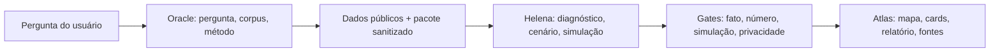

# Plano Helena + Oracle para o Atlas Brasil

Este plano traduz recursos úteis das skills Helena e Oracle Gnosis para o Atlas Brasil, em formato seguro para projeto aberto.

Não publica persona interna, memória, prompts completos, logs, caminhos locais, comandos privados ou bases brutas. O que entra no Atlas é o método público: pesquisa com fonte, inferência marcada, simulação com limite e relatório auditável.

## Papel de cada skill no Atlas

### Helena

Helena entra como camada de estratégia, simulação e decisão.

No Atlas, isso vira:

- contrato curto antes de análise relevante;
- diagnóstico territorial;
- geração de cenários;
- simulação com agentes sintéticos agregados;
- recomendação com ação, risco, custo relativo, KPI e confiança;
- red team obrigatório antes de publicar conclusão forte;
- poda de etapas que não melhoram qualidade, tempo, custo ou segurança.

### Oracle Gnosis

Oracle entra como camada de método, fontes e evidência.

No Atlas, isso vira:

- pergunta de pesquisa explícita;
- corpus e critérios de inclusão/exclusão;
- fonte primária antes de fonte secundária;
- separação entre fato e inferência;
- hierarquia de evidência;
- limites e lacunas;
- referência normalizada e rastreável.

## Princípio de integração



O Oracle decide se a evidência existe. A Helena decide o que aquilo muda na prática. O Atlas mostra ao usuário com clareza visual.

## Protocolo Atlas Research

Toda análise territorial profunda deve seguir este fluxo:

1. **Pergunta:** transformar a demanda em pergunta verificável.
2. **Escopo:** definir país, UF, cidade, período e domínio.
3. **Corpus:** listar fontes permitidas.
4. **Critérios:** declarar inclusão e exclusão.
5. **Extração:** coletar indicadores e metadados.
6. **Classificação:** marcar cada claim como fato, inferência, previsão, hipótese ou opinião.
7. **Síntese:** explicar achado principal, mecanismo e comparação.
8. **Red Team:** escrever contra-hipótese forte.
9. **Recomendação:** ação prática, risco, KPI e próxima validação.
10. **Limites:** dizer o que os dados não permitem afirmar.

## Perguntas que o Atlas deve responder melhor com Helena + Oracle

### Cidade melhorou?

Oracle:

- quais fontes medem isso;
- qual período é comparável;
- quais indicadores faltam.

Helena:

- qual indicador mais muda a decisão;
- qual gargalo aparece;
- qual oportunidade ou risco surge.

Saída:

- veredito com confiança;
- drivers;
- contradições;
- lacunas.

### Vale abrir farmácia ou padaria?

Oracle:

- população, renda, envelhecimento, fluxo urbano, empresas, saúde, concorrência quando houver fonte;
- fonte e ano.

Helena:

- hipótese de demanda;
- segmento mais provável;
- risco operacional;
- KPI de validação de campo.

Saída:

- score de oportunidade;
- premissas;
- dados faltantes;
- perguntas para confirmar antes de investir.

### Vale estudar medicina ou outra carreira?

Oracle:

- fontes sobre emprego, formação, saúde, demografia e renda;
- limites regionais.

Helena:

- horizonte de retorno;
- risco de saturação;
- necessidade de mobilidade;
- alternativas com melhor custo/benefício.

Saída:

- recomendação por horizonte;
- confiança;
- cenário base/otimista/estresse.

### Como um tema pode reagir numa cidade?

Oracle:

- histórico, demografia, canais, dados públicos disponíveis.

Helena:

- arquétipos agregados;
- dinâmica de propagação;
- fases de opinião: incubação, erupção, decaimento.

Saída:

- simulação rotulada;
- curva de intensidade;
- limitações explícitas;
- não tratar como pesquisa de campo.

## Atlas Evidence Ledger

Cada relatório ou pacote deve carregar um ledger público.

Campos sugeridos:

```json
{
  "claimId": "claim-001",
  "text": "O município cresceu em população entre os censos comparados.",
  "kind": "factual",
  "evidenceLevel": "primary_official",
  "sources": ["ibge-censo-2022"],
  "year": 2022,
  "confidence": "alta",
  "limitations": []
}
```

Hierarquia de evidência:

1. `primary_official`: IBGE, INEP, TSE, RAIS/CAGED, DATASUS, Tesouro, prefeitura com dado aberto.
2. `primary_non_official`: base primária privada sanitizada ou levantamento próprio publicável.
3. `systematic_review`: revisão sistemática ou meta-análise.
4. `secondary_analysis`: análise de instituto, relatório técnico, imprensa com dados.
5. `expert_interpretation`: interpretação especializada.
6. `simulation`: saída de agente sintético ou cenário.
7. `assumption`: premissa declarada.

Regra: simulação e premissa nunca sobem para fato.

## Contrato de tarefa para pacotes Atlas

Antes de gerar pacote público:

```yaml
atlas_task_contract:
  objetivo: "Gerar pacote público de inteligência para SE"
  saida_obrigatoria:
    - state-pack.json
    - synthetic-cohort-pack.json
    - simulation-pack.json
    - sources.json
    - manifest.json
  fontes_permitidas:
    - oficiais_publicas
    - pacote_sintetico_sanitizado
  proibido:
    - personas_brutas
    - prompts_internos
    - logs
    - caminhos_locais
    - chaves
  verificacao:
    - schema_valido
    - sem_segredos
    - sem_persona_bruta
    - numeros_com_fonte
    - simulacao_com_disclaimer
```

## Gates combinados

### Gate Oracle

Bloqueia se:

- pergunta de pesquisa não está clara;
- corpus não foi declarado;
- fonte primária foi ignorada sem justificativa;
- fato e inferência estão misturados;
- ausência de limites;
- referência incompleta.

### Gate Helena

Bloqueia se:

- recomendação não tem ação verificável;
- cenário não tem premissas;
- simulação não tem seed/limite/disclaimer;
- não existe contra-hipótese;
- confiança não foi calibrada.

### Gate Atlas Público

Bloqueia se:

- contém dado privado;
- contém caminho local;
- contém prompt interno;
- contém persona bruta;
- contém número sem fonte;
- contém conclusão mais forte que a evidência.

## Como isso melhora o Atlas Sim

Antes:

- mapa com dados;
- algumas análises e rankings.

Depois:

- mapa com método;
- relatório com evidence ledger;
- simulação com disclaimer;
- oportunidade local com premissas;
- recomendação com KPI;
- lacunas explícitas;
- fluxo replicável por cidade.

## Arquivos públicos recomendados

```text
docs/
  metodologia-publica.md
  metodologia-agentes-sinteticos.md
  plano-helena-oracle-atlas.md
  schemas/
    atlas-research-protocol.schema.json
    atlas-state-pack.schema.json
    atlas-synthetic-cohort.schema.json
    atlas-simulation-pack.schema.json
```

## Roadmap

### Fase 1 - Metodologia pública

Criar:

- `metodologia-publica.md`;
- `metodologia-agentes-sinteticos.md`;
- schema de research protocol;
- checklist de gates.

### Fase 2 - Pacote Sergipe

Aplicar Oracle para fontes e Helena para diagnóstico/simulação.

Saída pública:

- `state-pack.json`;
- `synthetic-cohort-pack.json`;
- `simulation-pack.json`;
- `evidence-ledger.json`.

### Fase 3 - UI no Atlas

Mostrar:

- pergunta de pesquisa;
- fonte por claim;
- inferência marcada;
- simulação marcada;
- red team resumido;
- confiança.

### Fase 4 - São Paulo

Escalar:

- coortes regionais;
- clusters;
- oportunidades econômicas;
- teste de performance.

### Fase 5 - Assistente territorial

O assistente deve responder usando:

- pacote público;
- evidence ledger;
- fontes oficiais;
- recusa honesta quando faltar fonte.

Não deve usar prompt interno nem memória privada no frontend público.

## Definition of Done

Uma análise Atlas com Helena + Oracle só está pronta quando:

- a pergunta está explícita;
- o corpus está declarado;
- os critérios de inclusão/exclusão aparecem;
- cada claim tem tipo;
- cada número tem fonte;
- inferência está marcada;
- simulação tem disclaimer;
- red team existe;
- limites estão visíveis;
- schema valida;
- privacidade passa.

## Decisão recomendada

Usar Oracle como **porteiro da evidência** e Helena como **motor de decisão**.

Essa divisão evita dois erros: relatório bonito sem fonte e banco de dados correto sem inteligência prática.
