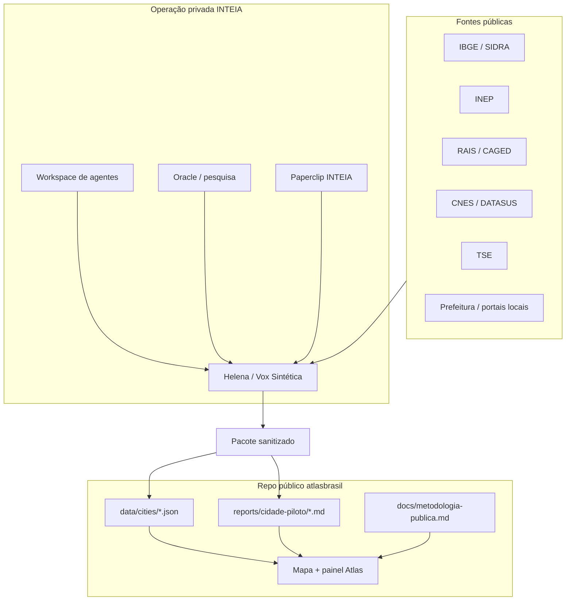

# Plano de inteligência INTEIA para o Atlas Brasil

Este plano transforma o Atlas Brasil em uma vitrine pública de inteligência territorial, sem publicar a operação privada da INTEIA, Helena, Paperclip, Oracle, agentes, chaves, logs ou memórias.

## Objetivo do produto

O Atlas deve responder, com dados e fontes:

- o país, estado ou município melhorou ou piorou;
- quais são os pontos fortes e fracos do território;
- quais oportunidades existem para negócios, estudo, saúde, política pública e investimento local;
- quais hipóteses são sólidas, plausíveis ou especulativas;
- como conversar com um assistente que conhece a cidade, mas só afirma fatos rastreáveis.

O primeiro alvo deve ser uma cidade piloto média, bem digitalizada e com dados públicos suficientes. Jaraguá do Sul é uma boa candidata inicial: porte controlável, economia local relevante e complexidade menor que uma metrópole.

## Fontes internas estudadas

### `v2_HELENA_MEGAPOWER`

Contribuição principal: método.

- harness de 14 estágios para transformar briefing em relatório defensável;
- ciclo anti-alucinação com claims, fontes, auditoria numérica, red team e bundle reproduzível;
- poder preditivo com base rates, Brier score, calibração e tags epistêmicas;
- simulações e agentes sintéticos como camada de hipótese, não como verdade final.

Uso recomendado no Atlas: converter a doutrina em metodologia pública simples e usar a Helena por fora para gerar pacotes estáticos sanitizados.

### Vox Sintética Platform

Contribuição principal: implementação real do motor privado.

- monorepo já contém contratos de harness, persona, provenance e report;
- `packages/pipeline` já tem estágios, forecast ledger, Brier rolling, provenance graph, delivery gate, bundle verify e trajectory eval;
- `apps/api-helena` funciona como base de API privada;
- `apps/reports` pode inspirar visualização de relatórios;
- o status do repo indica que os 14 stages estão majoritariamente implementados e testados.

Uso recomendado no Atlas: não copiar o monorepo. Usar como gerador privado de artefatos `city_profile`, `diagnostics`, `opportunities`, `sources` e `manifest`, que o Atlas consome como JSON estático.

### Workspace de Agentes

Contribuição principal: acervo de agentes sintéticos, app de pesquisa, entrevistas e serviços.

- tem backend FastAPI, frontend Next.js e base de eleitores sintéticos;
- contém serviços de entrevistas, pesquisas, resultados, insights, cenários, motor preditivo, Helena, memória, WhatsApp, multimodal e consulta unificada;
- traz bases de consultores, parlamentares, gestores e agentes sintéticos.

Uso recomendado no Atlas: reaproveitar padrões de entrevista, simulação, segmentação e consulta. Não publicar bases brutas, prompts, memórias, `.env`, usuários, rotas privadas, logs nem dados políticos sensíveis.

### `Proposta reestruturação INTEIA`

Contribuição principal: PRD e arquitetura de produto.

- define Vox Sintética como produto de decisão defensável;
- organiza interfaces: app cliente, cockpit, reports viewer, Helena sem UI;
- descreve integração de eleitores sintéticos e expansão nacional;
- registra milestones e critérios de aceite.

Uso recomendado no Atlas: extrair a versão pública da tese: "inteligência territorial com fonte, método e limite". Evitar valores comerciais, cliente político, operação interna e decisões privadas.

### `paperclip-inteia`

Contribuição principal: governança de execução.

- possui constituição operacional, fábrica de agentes, harness, observabilidade, aprendizado, evaluators e políticas de auditoria;
- dá o modelo de trabalho: issue, evidência, teste, auditoria, postmortem e melhoria aplicada;
- serve para coordenar agentes e transformar plano em tarefas.

Uso recomendado no Atlas: usar Paperclip em ambiente privado para orquestrar implementação e auditoria. No repo público, publicar apenas plano, changelog e critérios de aceite sanitizados.

## Arquitetura recomendada



Regra central: o Atlas público é o consumidor e expositor. A inteligência pesada roda fora, gera pacote auditável, e só o pacote sanitizado entra no GitHub.

## Modelo de dados público

Estrutura recomendada:

```text
data/
  cities/
    4208906/
      profile.json
      indicators.json
      diagnostics.json
      opportunities.json
      sources.json
      assistant_pack.json
      manifest.json

reports/
  jaragua-do-sul/
    resumo.md
    metodologia.md
    manifest.json
```

Campos mínimos por indicador:

```json
{
  "id": "economia.pib_per_capita",
  "label": "PIB por habitante",
  "value": 0,
  "unit": "BRL/hab",
  "year": 2021,
  "previousValue": 0,
  "previousYear": 2020,
  "direction": "melhorou",
  "deltaPercent": 0,
  "benchmark": {
    "scope": "cidades_pares",
    "position": 0,
    "total": 0
  },
  "claimKind": "factual",
  "confidence": "alta",
  "sources": ["sidra-5938"]
}
```

Campos mínimos por diagnóstico:

```json
{
  "scope": "municipio",
  "cityId": "4208906",
  "headline": "Jaraguá do Sul combina força industrial com pressão por qualificação técnica",
  "verdict": "melhorou_com_alertas",
  "strengths": [],
  "weaknesses": [],
  "opportunities": [],
  "risks": [],
  "claims": [],
  "generatedBy": "private-inteia-pipeline",
  "generatedAt": "2026-05-04T00:00:00-03:00"
}
```

## Camadas de inteligência

### 1. Raio-x territorial

Primeira camada pública. Mostra população, PIB, educação, saúde, emprego, renda, empresas, política, infraestrutura e série histórica.

Entrega no Atlas:

- painel "Resumo da cidade";
- card "melhorou / piorou / estável";
- rankings contra estado, região e cidades parecidas;
- fonte clicável por número.

### 2. Diagnóstico Helena

Camada gerada por fora do repo.

Entrega no Atlas:

- pontos fortes;
- pontos fracos;
- hipóteses causais;
- sinais de alerta;
- perguntas que ainda faltam responder;
- nível de confiança.

### 3. Oportunidades práticas

Responde perguntas de decisão local:

- abrir farmácia;
- abrir padaria;
- escolher curso superior;
- investir em nicho de serviço;
- priorizar política pública;
- entender bairro ou região.

Cada oportunidade precisa declarar:

- público-alvo;
- evidências;
- premissas;
- riscos;
- dados ausentes;
- grau de confiança.

### 4. Assistente da cidade

Não deve rodar com chave no frontend público.

Modelo recomendado:

- frontend público chama API privada;
- API privada usa RAG fechado em `assistant_pack.json` + fontes públicas;
- resposta sempre cita fonte ou diz que não sabe;
- nenhuma memória pessoal ou prompt interno é exposto.

### 5. Simulação e agentes sintéticos

Camada útil, mas perigosa se apresentada como fato.

Uso correto:

- simular cenários;
- testar hipóteses;
- estimar reação de grupos;
- comparar cenários antes/depois;
- sinalizar "simulação", "proxy" ou "estimativa".

Uso proibido no público:

- dizer que simulação é pesquisa real;
- publicar agentes brutos;
- publicar microdados sintéticos sensíveis;
- publicar prompts internos de persona.

## Critério "melhorou ou piorou"

O veredito territorial deve combinar:

1. evolução temporal do próprio município;
2. comparação com cidades pares;
3. comparação com estado e Brasil;
4. relevância prática do indicador;
5. confiabilidade da fonte;
6. penalização por dados ausentes.

Exemplo de escala:

- `melhorou_forte`
- `melhorou`
- `estavel`
- `piorou`
- `piorou_forte`
- `inconclusivo`

Nenhum veredito pode depender só de um indicador.

## Segurança e fronteira público/privado

Pode entrar no repo público:

- metodologia pública;
- schemas;
- JSON sanitizado com dados oficiais;
- relatórios sem cliente, chave, prompt privado ou dado pessoal;
- fontes e hashes;
- exemplos com cidade piloto.

Não pode entrar:

- `.env`, tokens, credenciais, cookies, headers e configs internas;
- logs brutos, JSONL bruto, uploads, `.artifacts`, `.helena_upload`;
- prompts internos completos da Helena, Oracle ou Paperclip;
- memórias, notas pessoais, histórico de conversa, nomes privados de cliente;
- endpoints privados, IPs, tokens de bot, JWTs ou paths de segredo;
- bases sintéticas brutas quando não houver versão pública sanitizada;
- estratégia comercial privada.

Antes de qualquer commit público:

```text
1. rodar varredura de segredo;
2. revisar `git diff`;
3. conferir que nenhum arquivo veio de pasta privada por cópia direta;
4. confirmar que todo dado publicado tem fonte pública;
5. confirmar que toda inferência está marcada como inferência.
```

## Roadmap de implementação

### Fase 0 - Fundação pública

Entregáveis:

- este plano;
- `docs/metodologia-publica.md`;
- schema JSON inicial;
- cidade piloto escolhida;
- `.gitignore` reforçado.

Critério de aceite:

- qualquer pessoa entende o que o Atlas faz sem ver a operação privada;
- nenhum segredo ou artefato bruto no repo.

### Fase 1 - Cidade piloto estática

Entregáveis:

- pacote `data/cities/{codigo_ibge}/`;
- relatório `reports/{cidade}/resumo.md`;
- painel no Atlas para "Resumo inteligente";
- cards de forças, fraquezas, oportunidades e riscos.

Critério de aceite:

- a cidade abre no mapa;
- o usuário vê se melhorou ou piorou;
- cada número tem fonte;
- o app funciona sem backend.

### Fase 2 - Gerador privado Helena/Vox

Entregáveis privados:

- script/exporter que gera `profile.json`, `indicators.json`, `diagnostics.json`, `sources.json` e `manifest.json`;
- gate de claims e auditoria numérica;
- bundle reproduzível privado.

Entregáveis públicos:

- somente o pacote sanitizado.

Critério de aceite:

- pacote pode ser regenerado;
- diferenças entre versões são explicáveis;
- relatório público não contém operação interna.

### Fase 3 - Assistente da cidade

Entregáveis:

- `assistant_pack.json` por cidade;
- endpoint privado de perguntas;
- UI de chat no Atlas;
- respostas com fontes.

Critério de aceite:

- perguntas sem fonte recebem recusa honesta;
- nenhuma chave aparece no frontend;
- o usuário consegue perguntar sobre cidade, história, economia e decisões práticas.

### Fase 4 - Oportunidades e decisão local

Entregáveis:

- matriz de oportunidade por setor;
- perguntas prontas: farmácia, padaria, curso, emprego, bairro, política pública;
- score de oportunidade com premissas e risco.

Critério de aceite:

- cada recomendação mostra dados usados, limitações e confiança;
- oportunidades são comparáveis entre cidades.

### Fase 5 - Escala nacional

Entregáveis:

- pipeline para várias cidades;
- rankings e clusters de cidades semelhantes;
- monitoramento de indicadores;
- changelog de versões de dados.

Critério de aceite:

- adicionar uma cidade nova não exige mexer no código principal;
- regressões são detectadas por teste de schema e manifest.

## Próximas tarefas recomendadas

1. Definir a cidade piloto oficialmente.
2. Criar `docs/metodologia-publica.md`.
3. Criar schema JSON em `docs/schemas/`.
4. Gerar manualmente o primeiro pacote da cidade piloto com dados públicos.
5. Alterar `app.js` para carregar `data/cities/{codigo}/diagnostics.json`.
6. Adicionar seção "Inteligência territorial" no painel.
7. Depois integrar o gerador privado Helena/Vox.

## Decisão técnica recomendada

Não transformar o Atlas no `voxsintetica-platform`.

O Atlas deve continuar simples, público e auditável. A Vox/Helena deve ser o motor privado. A ponte entre os dois deve ser arquivo de dados sanitizado, com fonte, manifest e versão.

## Aprofundamento SP/Sergipe

O plano detalhado para empoderar o Atlas com SP, Sergipe, coortes sintéticas e simulações públicas está em [`docs/plano-empoderamento-atlas-sp-se.md`](plano-empoderamento-atlas-sp-se.md).

## Helena + Oracle

A adaptação das skills Helena e Oracle Gnosis para o método público do Atlas está em [`docs/plano-helena-oracle-atlas.md`](plano-helena-oracle-atlas.md).
